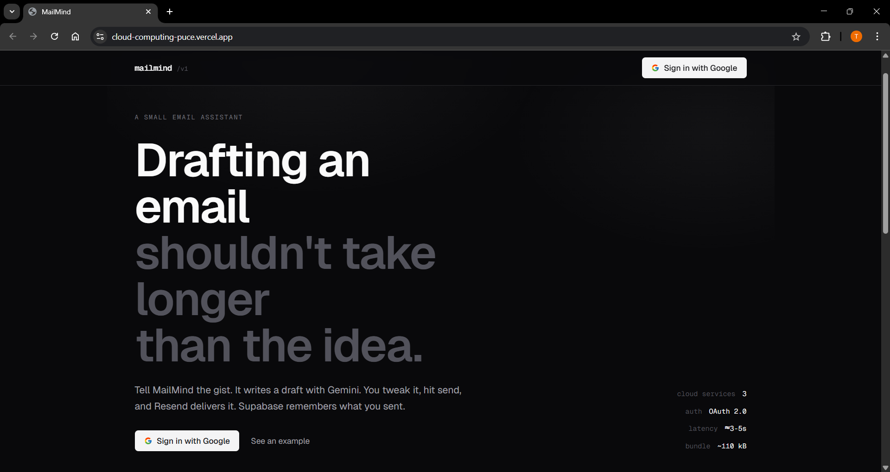
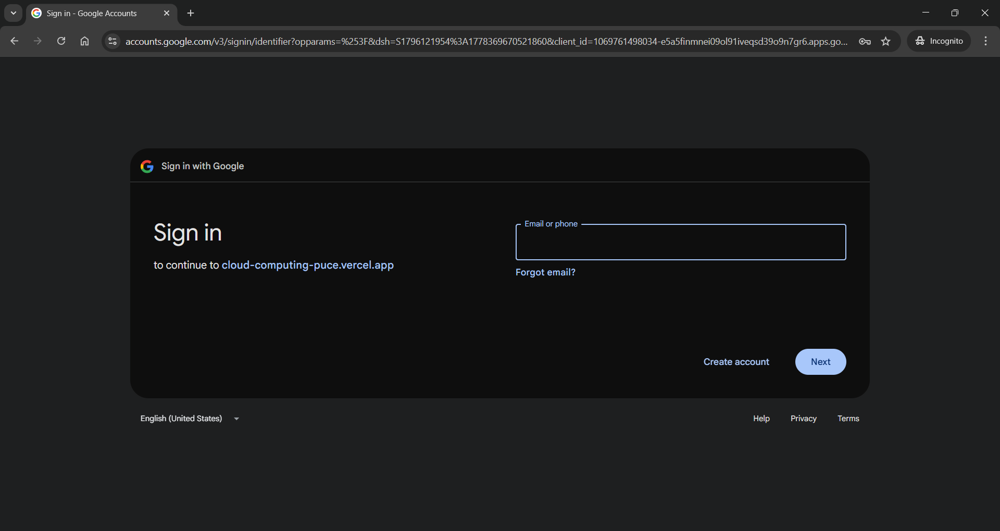
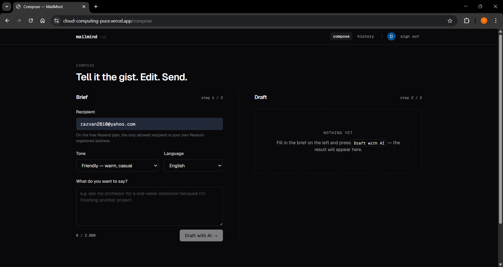
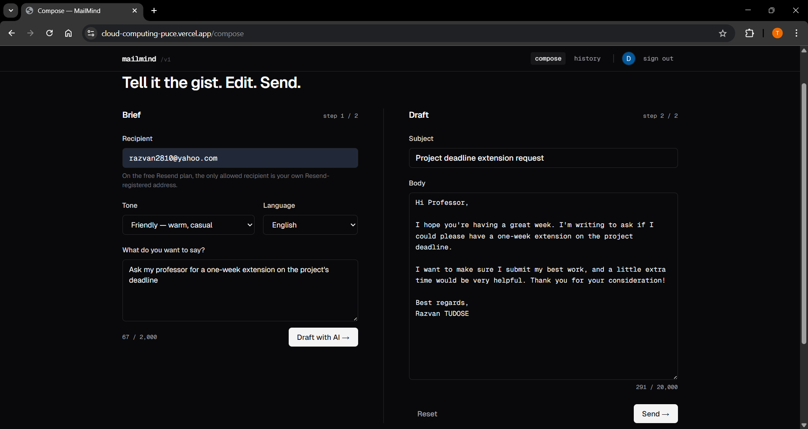
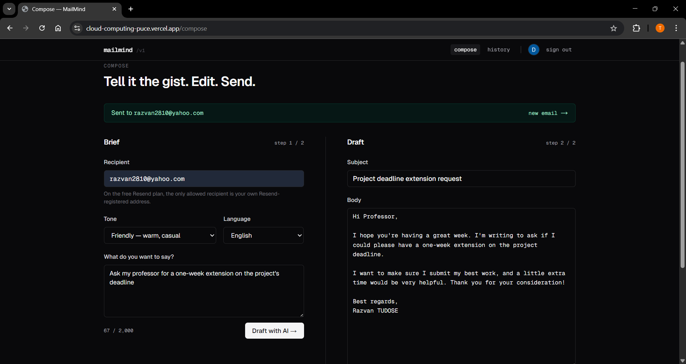
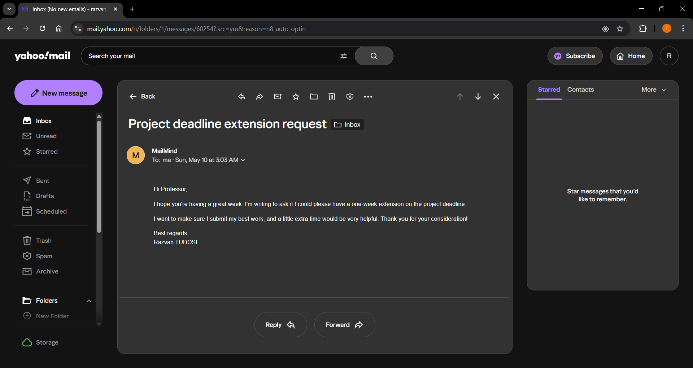
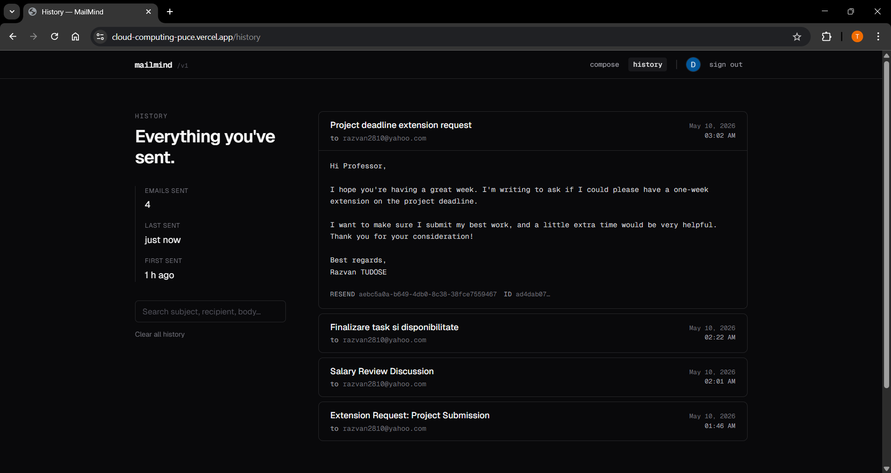

# MailMind · Tudose Razvan, grupa 1147

Aplicatie web care redacteaza emailuri cu ajutorul AI si le trimite.

> Proiect pentru cursul de Cloud Computing (SIMPRE Master, Anul 1, Semestrul 2)

| | |
|---|---|
| Demo | https://cloud-computing-puce.vercel.app |
| Video prezentare | — |

---

## 1. Introducere

MailMind este o aplicatie web construita peste trei servicii cloud:

- **Google Gemini API**: genereaza subiectul si corpul emailului pe baza unui prompt scurt.
- **Resend**: livreaza emailul prin REST API.
- **Supabase (Postgres)**: pastreaza istoricul mesajelor trimise pentru fiecare utilizator.

Autentificarea este gestionata de **Auth.js v5** cu providerul **Google OAuth**;
sesiunea este stocata intr-un cookie JWT HTTP-only, deci persista la refresh
fara configurari suplimentare.

Frontend-ul si rutele API coexista intr-o singura aplicatie Next.js 15 (App
Router). Tot proiectul ruleaza pe planul gratuit Hobby de la Vercel.

## 2. Descriere problema

In practica, scrisul unui email scurt poate dura mai mult decat formularea
ideii in sine. Alegerea tonului, formula de salut, claritatea exprimarii si
limba in care scrii sunt decizii care consuma timp pentru un mesaj de cateva
fraze. Platformele de email existente (Gmail, Outlook) rezolva livrarea, dar
nu intervin in redactare.

MailMind se ocupa exact de aceasta etapa. Pornind de la o instructiune scurta
(de exemplu *"cere profesorului o saptamana in plus pentru proiect"*),
aplicatia genereaza un draft folosind Gemini, lasa utilizatorul sa il editeze,
il trimite prin Resend si il pastreaza in Supabase pentru consultare
ulterioara.

## 3. Descriere API

Aplicatia expune patru endpoint-uri REST. Cu exceptia handler-ului Auth.js,
toate verifica sesiunea server-side prin `auth()` si returneaza `401
Unauthorized` daca aceasta lipseste.

| Method   | Path                       | Scop                                            | Necesita auth |
| -------- | -------------------------- | ----------------------------------------------- | ------------- |
| `GET`/`POST` | `/api/auth/[...nextauth]`  | flow OAuth Auth.js + endpoint-uri sesiune       | nu            |
| `POST`   | `/api/generate`            | apel Google Gemini, returneaza draft JSON       | da            |
| `POST`   | `/api/send`                | apel Resend, apoi insert in Supabase            | da            |
| `GET`    | `/api/history`             | citeste randurile din Supabase pentru utilizator| da            |
| `DELETE` | `/api/history`             | sterge toate randurile utilizatorului curent    | da            |

### `POST /api/generate`

```http
POST /api/generate
Content-Type: application/json
Cookie: authjs.session-token=...

{
  "prompt": "ask my landlord to fix the heater, mention it's been 3 days",
  "tone": "formal",
  "language": "en",
  "recipientHint": "landlord@example.com"
}
```

`tone` ∈ `formal | friendly | concise | persuasive | apologetic`,
`language` ∈ `en | ro`. Implicit: `friendly` / `en`.

Ruta construieste un prompt structurat si il transmite la Gemini cu un
`responseSchema` care forteaza un output JSON cu forma stricta:

```http
HTTP/1.1 200 OK
{
  "subject": "Heater repair request, 3 days without heat",
  "body": "Dear ...\n\n..."
}
```

### `POST /api/send`

```http
POST /api/send
Content-Type: application/json

{
  "to": "you@example.com",
  "subject": "...",
  "text": "..."
}
```

Trimite mesajul prin Resend si insereaza un rand in tabelul `sent_emails`.
Campul `replyTo` este completat automat cu adresa utilizatorului autentificat.

```http
HTTP/1.1 200 OK
{
  "id": "f8e2...",
  "resendId": "ea1c...",
  "to": "you@example.com",
  "subject": "...",
  "sentAt": "2026-05-10T13:42:11.027Z"
}
```

### `GET /api/history`

```http
HTTP/1.1 200 OK
{
  "items": [
    {
      "id": "f8e2...",
      "user_email": "you@example.com",
      "recipient": "...",
      "subject": "...",
      "body": "...",
      "resend_id": "ea1c...",
      "sent_at": "2026-05-10T13:42:11.027Z"
    },
    …
  ]
}
```

### `DELETE /api/history`

Sterge toate randurile asociate utilizatorului curent.

```http
HTTP/1.1 200 OK
{ "removed": 7 }
```

### Format raspuns eroare

Orice raspuns non-2xx este un obiect JSON cu un camp `error`. Coduri folosite:

| Cod  | Semnificatie                                              |
|------|-----------------------------------------------------------|
| 400  | body invalid sau camp lipsa / cu valoare incorecta        |
| 401  | sesiune absenta                                           |
| 500  | esec Supabase (rute history)                              |
| 502  | apel upstream Gemini sau Resend a esuat                   |

## 4. Flux de date

```
        ┌──────────────┐
        │   Browser    │
        └──────┬───────┘
               │   ① flow sign-in
               ▼
   ┌───────────────────────────────────┐         OAuth 2.0
   │  /api/auth/[...nextauth]          │  ───►   accounts.google.com
   │  Auth.js, cookie JWT              │
   └──────┬────────────────────────────┘
               │   ② POST /api/generate
               ▼
   ┌───────────────────────────────────┐
   │  /api/generate                    │  ───►   generativelanguage.googleapis.com
   │  • verifica sesiunea              │         (gemini-flash-latest, JSON schema)
   │  • construieste prompt            │
   │  • parseaza JSON                  │
   └──────┬────────────────────────────┘
               │   ③ utilizatorul ajusteaza in form
               │   ④ POST /api/send
               ▼
   ┌───────────────────────────────────┐
   │  /api/send                        │  ───►   api.resend.com/emails
   │  • verifica sesiunea              │
   │  • Resend.send                    │  ───►   <project>.supabase.co
   │  • Supabase.insert                │         (sent_emails)
   └──────┬────────────────────────────┘
               │   ⑤ pagina de istoric citeste
               ▼
   ┌───────────────────────────────────┐
   │  GET /api/history                 │  ───►   <project>.supabase.co
   └───────────────────────────────────┘
```

### Metode HTTP

| Method   | Folosita de                                                 | Unde                                              |
|----------|-------------------------------------------------------------|---------------------------------------------------|
| `GET`    | sign-in / callback / sesiune Auth.js, listare istoric       | `/api/auth/...`, `/api/history`                   |
| `POST`   | redactare AI, trimitere email, sign-out                     | `/api/generate`, `/api/send`, `/api/auth/signout` |
| `DELETE` | stergere istoric                                            | `/api/history`                                    |

### Autentificare si autorizare catre serviciile cloud

| Serviciu      | Mecanism                                                  | Stocat in env var                                  |
| ------------- | --------------------------------------------------------- | -------------------------------------------------- |
| Google OAuth  | OAuth 2.0 cu client id + client secret                    | `AUTH_GOOGLE_ID`, `AUTH_GOOGLE_SECRET`             |
| Google Gemini | API key in header `x-goog-api-key` (gestionat de SDK)     | `GEMINI_API_KEY`                                   |
| Resend        | Bearer token (`Authorization: Bearer re_...`)             | `RESEND_API_KEY`                                   |
| Supabase      | service-role JWT (server-only, bypass RLS)                | `SUPABASE_URL`, `SUPABASE_SERVICE_ROLE_KEY`        |

Toate cele patru secrete exista exclusiv pe server (runtime-ul Next.js). Niciun
secret nu ajunge in bundle-ul livrat catre browser.

Cookie-ul de sesiune Auth.js este criptat cu `AUTH_SECRET` (HMAC + JWE prin
biblioteca `jose`); fara secret, cookie-ul nu poate fi nici forjat, nici citit.

## 5. Capturi ecran aplicatie















## 6. Referinte

- [Next.js App Router](https://nextjs.org/docs/app)
- [Auth.js (NextAuth v5), provider Google](https://authjs.dev/getting-started/providers/google)
- [Google AI, documentatia Gemini API](https://ai.google.dev/gemini-api/docs)
- [`@google/generative-ai` SDK](https://www.npmjs.com/package/@google/generative-ai)
- [Resend, Send Email API](https://resend.com/docs/api-reference/emails/send-email)
- [Supabase JS client](https://supabase.com/docs/reference/javascript)
- [Tailwind CSS](https://tailwindcss.com/docs)
- [Vercel, Deploying Next.js](https://vercel.com/docs/frameworks/nextjs)
- [Google OAuth 2.0](https://developers.google.com/identity/protocols/oauth2)
- [RFC 6749, The OAuth 2.0 Authorization Framework](https://datatracker.ietf.org/doc/html/rfc6749)

## Licenta

MIT.
